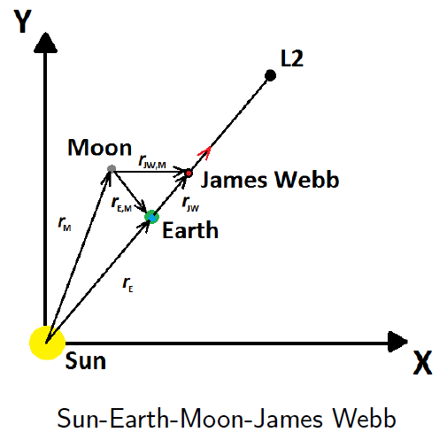
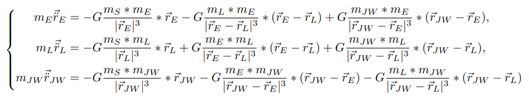
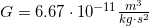
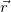
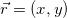
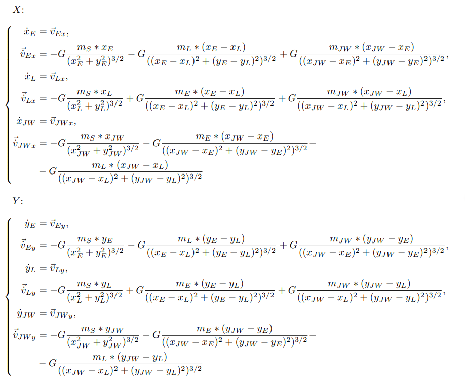
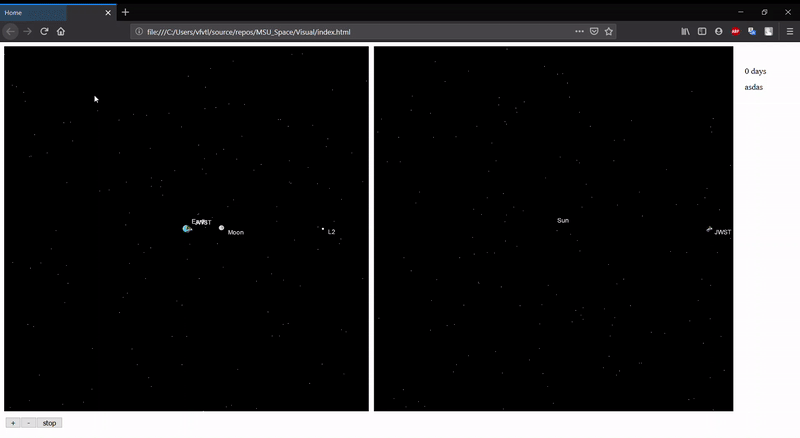

# MSU_Space

NASA Sapace Apps Azerbaijan 2019 <b>MSU_Space</b> team.


# Introduction

We are <i>“MSU_Space”</i>. Our challenge is called [“UP, OUT AND AWAY”](https://spaceapps.space.az/challenges/stars/and-away). Our main aim is to create
a simulation that will describe the motion of heaven bodies and James Webb’s trajectory to the point Lagrange2 in Solar System.

The image below describes the motion of all bodies in our system:

<p align="center">
  
</p>

We consider a two-dimensional system consisting of the Sun, Earth, Moon and James Webb. We
assume that the Sun is motionless, and we connect the remaining bodies with the Sun by radius vectors.
We have created a system of differential equations that describes our system. However, we didn’t take
into account the radiation of the sun and that the Earth is not spherical. Due to limitations in time we
had to simplify our model.

<p align="center">
  
</p>


Where  - gravitational constant and vector  have two components , indexes E - Earth, L - Moon, S - Sun, JW - James Webb.

We write the equations for the X and Y components and make a replacement of derivates:

<p align="center">
  
</p>

Then we have solved this system of differential equations using numerical methods.

This is the latest version of our program, but not final. We are going to develop it in the future. You
can see the Earth, the Moon, the Sun, James Webb St and point L2 on our video. You can see that near
to the Moon, James Webb did the gravitational maneuver and as a result of this it got an additional
velocity. To reach the desired orbit we have used the impulse maneuver. When James Webb reaches the
point L2 it will synchronize its coordinates and velocities with point L2. Although automatically it will
be able to stay there infinitely long time, the real model will not.


# Numerical Solution

```python

# Runge–Kutta method


# Constants
period = 2
T = int(period * 365 * 24.0)
M = int(period * 5000)
tau = (T - t_0) / M
t = t_0
S = 4
b = [1/6, 1/3, 1/3, 1/6]


# JW, Moon, Earth (x, y, vx, vy)
u_0 = np.array([x_JW_0, y_JW_0, vx_JW_0, vy_JW_0, x_moon_0, y_moon_0, vx_moon_0, vy_moon_0, x_earth_0, y_earth_0, vx_earth_0, vy_earth_0])
u = [np.copy(u_0)]

# James Webb
dot_x_JW = lambda U: U[2]
dot_y_JW = lambda U: U[3]
dot_vx_JW = lambda U: ((-1)*G*(Mass_Of_Sun*U[0]) / ((U[0]**2 + U[1]**2)**(3/2)) - G*(Mass_Of_Earth*(U[0] - U[8])) / (((U[0] - U[8])**2 + (U[1] - U[9])**2)**(3/2)) - G*(Mass_Of_Moon*(U[0] - U[4])) / (((U[0] - U[4])**2 + (U[1] - U[5])**2)**(3/2))) # vx_JW
dot_vy_JW = lambda U: ((-1)*G*(Mass_Of_Sun*U[1]) / ((U[0]**2 + U[1]**2)**(3/2)) - G*(Mass_Of_Earth*(U[1] - U[9])) / (((U[0] - U[8])**2 + (U[1] - U[9])**2)**(3/2)) - G*(Mass_Of_Moon*(U[1] - U[5])) / (((U[0] - U[4])**2 + (U[1] - U[5])**2)**(3/2))) # vy_JW

# Moon
dot_x_moon = lambda U: U[6]
dot_y_moon = lambda U: U[7]
dot_vx_moon = lambda U: ((-1)*G*(Mass_Of_Sun*U[4]) / ((U[4]**2 + U[5]**2)**(3/2)) + G*(Mass_Of_Earth*(U[8] - U[4])) / (((U[4] - U[8])**2 + (U[5] - U[9])**2)**(3/2)) + G*(Mass_Of_JW*(U[0] - U[4])) / (((U[0] - U[4])**2 + (U[1] - U[5])**2)**(3/2))) # vx_moon
dot_vy_moon = lambda U: ((-1)*G*(Mass_Of_Sun*U[5]) / ((U[4]**2 + U[5]**2)**(3/2)) + G*(Mass_Of_Earth*(U[9] - U[5])) / (((U[4] - U[8])**2 + (U[5] - U[9])**2)**(3/2)) + G*(Mass_Of_JW*(U[1] - U[5])) / (((U[0] - U[4])**2 + (U[1] - U[5])**2)**(3/2))) # vy_moon

# Earth
dot_x_earth = lambda U: U[10]
dot_y_earth = lambda U: U[11]
dot_vx_earth = lambda U: ((-1)*G*(Mass_Of_Sun*U[8]) / ((U[8]**2 + U[9]**2)**(3/2)) - G*(Mass_Of_Moon*(U[8] - U[4])) / (((U[4] - U[8])**2 + (U[5] - U[9])**2)**(3/2)) + G*(Mass_Of_JW*(U[0] - U[8])) / (((U[0] - U[8])**2 + (U[1] - U[9])**2)**(3/2))) # vx_earth
dot_vy_earth = lambda U: ((-1)*G*(Mass_Of_Sun*U[9]) / ((U[8]**2 + U[9]**2)**(3/2)) - G*(Mass_Of_Moon*(U[9] - U[5])) / (((U[4] - U[8])**2 + (U[5] - U[9])**2)**(3/2)) + G*(Mass_Of_JW*(U[1] - U[9])) / (((U[0] - U[8])**2 + (U[1] - U[9])**2)**(3/2))) # vy_earth

# Function for system of differential equations
function = lambda U: np.array([dot_x_JW(U), dot_y_JW(U), dot_vx_JW(U), dot_vy_JW(U), dot_x_moon(U), dot_y_moon(U), dot_vx_moon(U), dot_vy_moon(U), dot_x_earth(U), dot_y_earth(U), dot_vx_earth(U), dot_vy_earth(U)])


def sum_1(k, omega):
    if k == 1:
        return 0
    elif k == 2:
        return 0.5 * np.copy(np.array(omega[0]))
    elif k == 3:
        return 0.5 * np.copy(np.array(omega[1]))
    elif k == 4:
        return np.copy(np.array(omega[2]))


def sum_2(omega):
    sum_val = b[0] * omega[0]
    for i in range(1, S):
        sum_val += b[i] * np.copy(omega[i])
    return sum_val


for m in range(M):

    omega = []
    for k in range(1, S+1):
    
        p = np.copy(u[m]) + tau * np.copy(sum_1(k, omega))

        omega.append(function([p[0], p[1], p[2], p[3], p[4], p[5], p[6], p[7], p[8], p[9], p[10], p[11]]))

    new_u = np.copy(u[m]) + tau * np.copy(sum_2(omega))
    
    u.append(new_u)


```


# Visualisations




# Our future plans

1. We want to give freedom for user’s imagination! We are going to add functions, that will allow users to change different parameters, such as mass, velocity and distances.

2. We are going to add Venus, Jupiter, Saturn, Pluto, Mercury, Mars, Uranus and Neptune. And we want to make it more realistic.

3. We are going to take into account relativistic effects and radiation of the Sun.

4. We want to develop our game/simulation and make it three dimensional.

5. We will add encyclopedia for users! There will be descriptions of the planets, Sun and other objects in the Solar system and different facts about it.